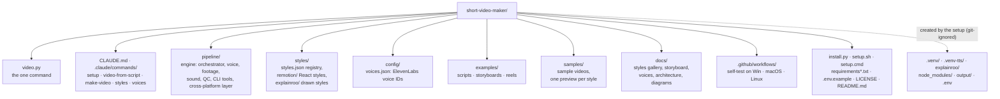

# Diagram 4: repository structure

```mermaid
flowchart TD
    ROOT[short-video-maker/]
    ROOT --> V[video.py<br/>the one command]
    ROOT --> CL[CLAUDE.md · .claude/commands/<br/>setup · video-from-script · make-video · styles · voices]
    ROOT --> P[pipeline/<br/>engine: orchestrator, voice, footage,<br/>sound, QC, CLI tools, cross-platform layer]
    ROOT --> S[styles/<br/>styles.json registry,<br/>remotion/ React styles,<br/>explainroo/ drawn styles]
    ROOT --> C[config/<br/>voices.json: ElevenLabs voice IDs]
    ROOT --> EX[examples/<br/>scripts · storyboards · reels]
    ROOT --> SM[samples/<br/>sample videos,<br/>one preview per style]
    ROOT --> DOC[docs/<br/>styles gallery, storyboard,<br/>voices, architecture, diagrams]
    ROOT --> CI[.github/workflows/<br/>self-test on Win · macOS · Linux]
    ROOT --> F[install.py · setup.sh · setup.cmd<br/>requirements*.txt · .env.example · LICENSE · README.md]
    ROOT -. "created by the setup (git-ignored)" .-> G[.venv/ · .venv-tts/ · explainroo/<br/>node_modules/ · output/ · .env]
```
