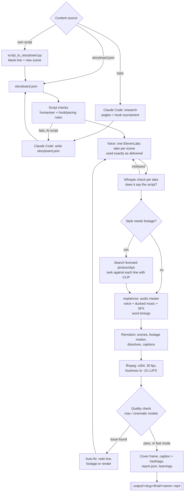

# Diagram 2: video generation workflow

```mermaid
flowchart TD
    A{Content source} -->|own script| B[script_to_storyboard.py<br/>blank line = new scene]
    A -->|topic| C[Claude Code: research<br/>angles + hook tournament]
    C --> D[Claude Code: write storyboard.json]
    A -->|storyboard.json| E
    B --> E[storyboard.json]
    D --> E
    E --> F[Script checks<br/>humaniser + hook/pacing rules]
    F -->|fails, AI script| D
    F --> G[Voice: one ElevenLabs take per scene<br/>used exactly as delivered]
    G --> H[Whisper check per take<br/>does it say the script?]
    H -->|misheard| G
    H --> J{Style needs footage?}
    J -->|yes| K[Search licensed photos/clips<br/>rank against each line with CLIP]
    J -->|no| L
    K --> L[explainroo: audio master<br/>voice + ducked music + SFX<br/>word timings]
    L --> M[Remotion: scenes, footage motion,<br/>dissolves, captions]
    M --> N[ffmpeg: x264, 30 fps,<br/>loudness to -15 LUFS]
    N --> O{Quality check<br/>max / cinematic modes}
    O -->|issue found| P[Auto-fix: redo line,<br/>footage or render] --> G
    O -->|pass, or fast mode| Q[Cover frame, caption + hashtags,<br/>report.json, learnings]
    Q --> R[[output/&lt;slug&gt;/final/&lt;name&gt;.mp4]]
```
